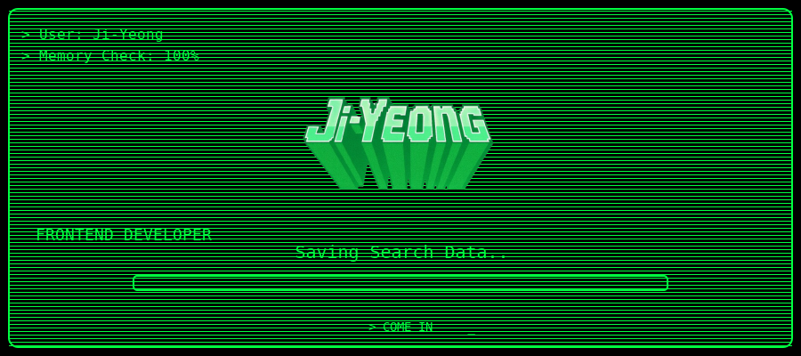

<!-- 1. 제목 ASCII -->
<pre align="center">
██╗  ██╗███████╗██╗     ██╗      ██████╗     ██╗    ██╗ ██████╗ ██████╗ ██╗     ██████╗ 
██║  ██║██╔════╝██║     ██║     ██╔═══██╗    ██║    ██║██╔═══██╗██╔══██╗██║     ██╔══██╗
███████║█████╗  ██║     ██║     ██║   ██║    ██║ █╗ ██║██║   ██║██████╔╝██║     ██║  ██║
██╔══██║██╔══╝  ██║     ██║     ██║   ██║    ██║███╗██║██║   ██║██╔══██╗██║     ██║  ██║
██║  ██║███████╗███████╗███████╗╚██████╔╝    ╚███╔███╔╝╚██████╔╝██║  ██║███████╗██████╔╝
╚═╝  ╚═╝╚══════╝╚══════╝╚══════╝ ╚═════╝      ╚══╝╚══╝  ╚═════╝ ╚═╝  ╚═╝╚══════╝╚═════╝ 
</pre>

<pre align="center">
> SYSTEM BOOT SEQUENCE INITIATED
</pre>

<!-- 2. 로딩 -->

  
  &nbsp;&nbsp;
  

  

 

  
  &nbsp;
  

               

<!-- 

  

 -->

  

       &nbsp
   &nbsp
 &nbsp
 &nbsp 

      

  

  

  

 

  

<!--  -->

