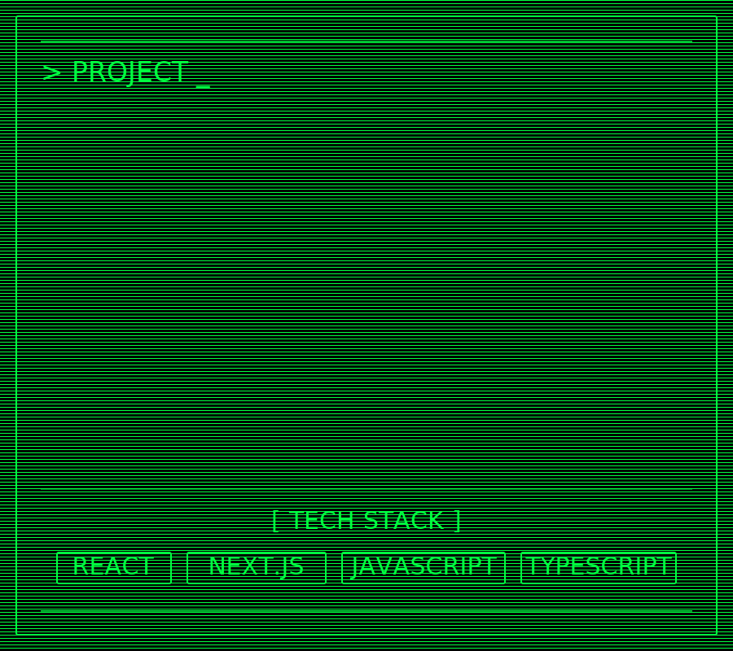

  
<code>&gt; HELLO_WORLD (BOOT BANNER)</code>

   
  

    <pre>
██╗  ██╗███████╗██╗     ██╗      ██████╗     ██╗    ██╗ ██████╗ ██████╗ ██╗     ██████╗ 
██║  ██║██╔════╝██║     ██║     ██╔═══██╗    ██║    ██║██╔═══██╗██╔══██╗██║     ██╔══██╗
███████║█████╗  ██║     ██║     ██║   ██║    ██║ █╗ ██║██║   ██║██████╔╝██║     ██║  ██║
██╔══██║██╔══╝  ██║     ██║     ██║   ██║    ██║███╗██║██║   ██║██╔══██╗██║     ██║  ██║
██║  ██║███████╗███████╗███████╗╚██████╔╝    ╚███╔███╔╝╚██████╔╝██║  ██║███████╗██████╔╝
╚═╝  ╚═╝╚══════╝╚══════╝╚══════╝ ╚═════╝  ,   ╚══╝╚══╝  ╚═════╝ ╚═╝  ╚═╝╚══════╝╚═════╝  !
    </pre>
    <pre align="center">
> SYSTEM BOOT SEQUENCE INITIATED
</pre>
  

<!-- ------------------------------------------------------------------------------------ -->

  

  

  

 
<!--  로딩  -->

<!-- 

  
    <picture>
      <source media="(max-width: 600px)" srcset="./loader_spinner_mobile.svg" />
      
    </picture>
    
    <picture>
      <source media="(max-width: 600px)"
        srcset="https://readme-typing-svg.demolab.com?font=Silkscreen&size=18&duration=50&pause=450&color=00FF41&center=true&vCenter=true&width=150&height=28&lines=LOADING.........;L0ADING.........;LOAD1NG.........;LOADING.._......;L0AD1NG.........;LOADING........." />
      
    </picture>
  

 -->

  
    <!-- 스피너 -->
    <picture style="display:inline-block; vertical-align:middle;">
      <source media="(max-width: 600px)" srcset="./loader_spinner_mobile.svg" />
      
    </picture>
<!-- 확실한 간격: 투명 1x1 이미지(10px 폭) -->
    
<!-- LOADING 텍스트 -->
    <picture style="display:inline-block; vertical-align:middle;">
      <source media="(max-width: 600px)"
        srcset="https://readme-typing-svg.demolab.com?font=Silkscreen&size=18&duration=50&pause=450&color=00FF41&center=true&vCenter=true&width=150&height=28&lines=LOADING.........;L0ADING.........;LOAD1NG.........;LOADING.._......;L0AD1NG.........;LOADING........." />
      
    </picture>
  

 

<!-- 인트로 (COME IN까지): 폭 ≤ 640px에서 모바일 전용 사용 -->

<!-- <picture>
  <source media="(max-width: 640px)" srcset="./final_CRT_intro_mobile.svg" />
  
</picture> -->
<picture>
  <source media="(max-width: 640px)" srcset="./CRT_intro_mobile.svg" />
  
</picture>

<!-- 메인 (PROJECT ~ TECH STACK): 이미 설정한 대로 -->
<picture>
  <source media="(max-width: 640px)" srcset="./CRT_main_mobile.svg" />
  
</picture>

<!-- -------------------------------------------------------------------------------------- -->

  
  

  

  

  

  

  

